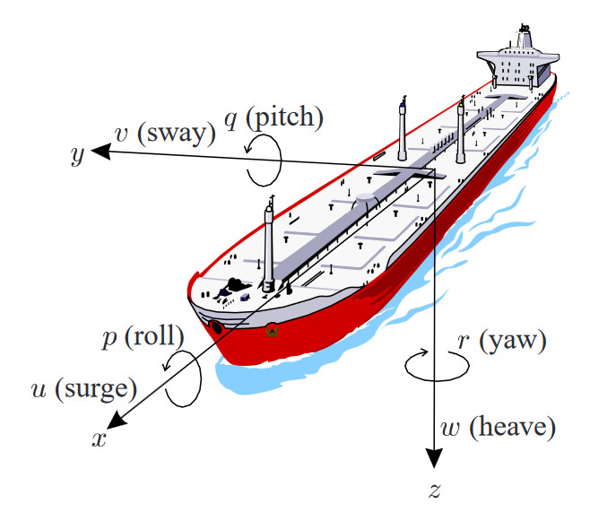
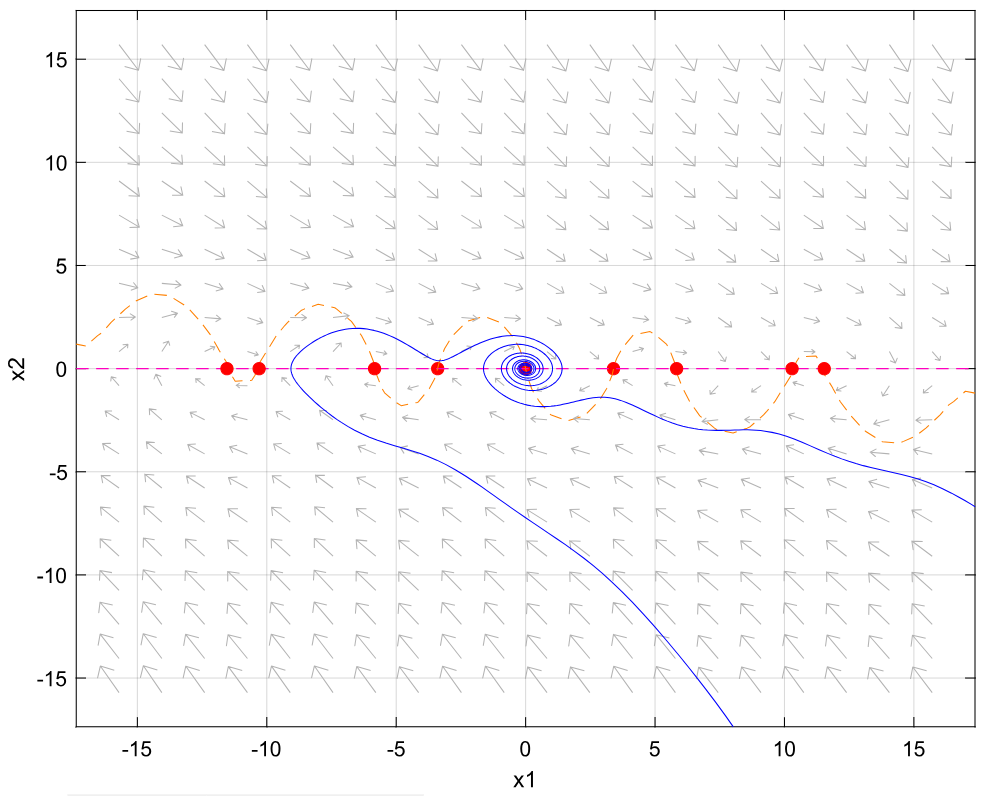
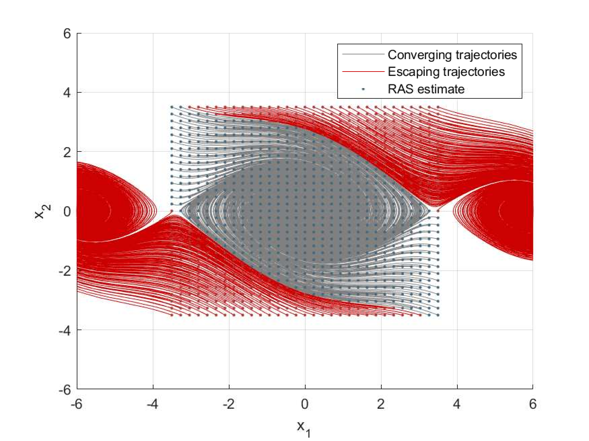
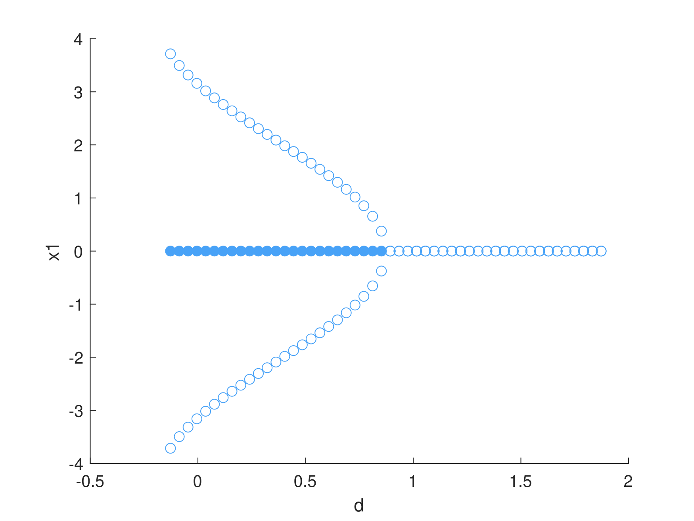
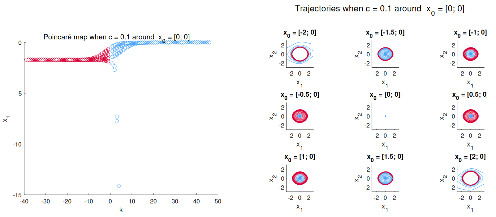
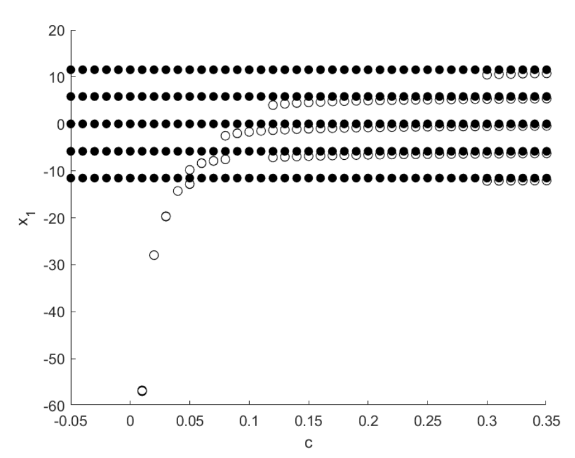
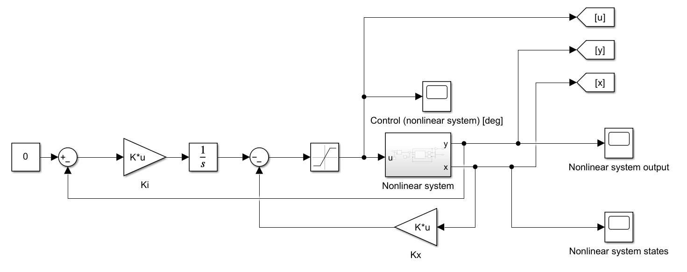
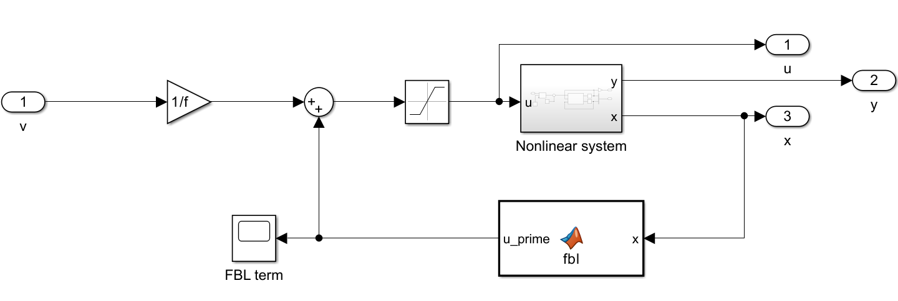
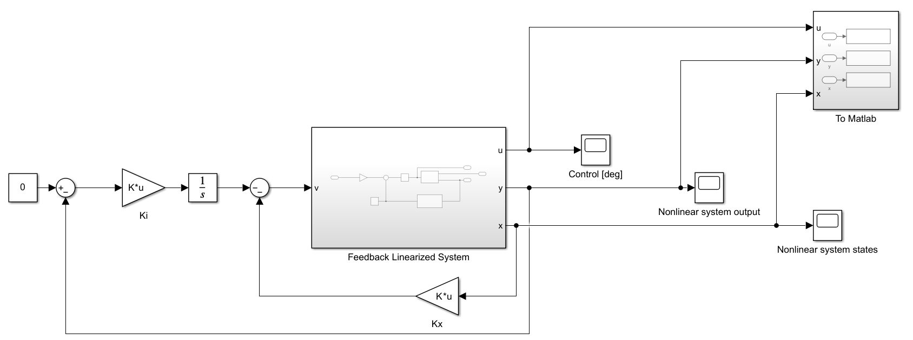
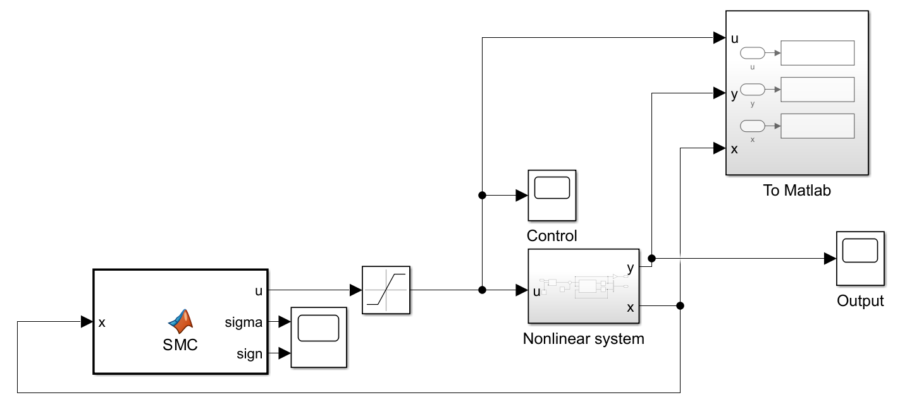

# Ship Roll Stabilization with Active Fins

This project presents an analysis and control of the 1-DOF roll dynamics of a ship using active fins for stabilization. The control system aims to maintain the ship's upright attitude and dampen oscillations caused by wave disturbances. This research includes:

- Motivations for ship roll stabilization.
- Development of a 1-DOF state space model for roll dynamics.
- Stability analysis of the system.
- Comparison of linear and nonlinear control strategies.
- Testing controller robustness under various parameter uncertainties.

The complete report is available [here](./media/Tesina.pdf).

## Problem Description

The roll motion of a ship in rough seas can pose safety risks, such as cargo shifting and passenger discomfort. Active fin stabilizers are one of the most effective solutions to counteract roll motion. The fins generate torque to compensate for disturbances caused by waves. This project focuses on modeling the roll dynamics and designing controllers to stabilize the ship's roll motion.

<div align="center">
  
  <p><em>Six degrees of freedom of a vessel</em></p>
</div>

## Mathematical Model

The ship roll dynamics are described by the following state-space equations:

```math
\begin{aligned}
\dot{x}_1 &= x_2 \\
\dot{x}_2 &= bx_2 + cx_2|x_2| + dx_1 + e\sin(x_1) + \varphi u
\end{aligned}
```

Where:
- $x_1$ = roll angle
- $x_2$ = roll rate
- $b, c, d, e, \varphi$ = coefficients derived from physical parameters
- $u$ = control input (fin angle)

## Analysis

The system's internal and structural stability was thoroughly analyzed using the derived 1-DOF model. The equilibrium points of the system were identified, revealing multiple equilibria due to the nonlinear nature of the equations. Key findings from the analysis include:

- **Equilibrium Points:** The system has nine equilibrium points, with the origin being the only one of interest as it represents the ship in an upright attitude.

<div align="center">
  
  <p><em>Phase plane analysis</em></p>
</div>

- **Stability:** The origin was found to be a locally asymptotically stable (LAS) equilibrium point with a large region of attraction, indicating that the system tends to return to the upright position after perturbations.

<div align="center">
  
  <p><em>RAS Simulation</em></p>
</div>

- **Bifurcation Analysis:** Various bifurcations were studied by varying system parameters ($b$, $c$, $d$, and $e$). Hopf bifurcations and pitchfork bifurcations were observed, providing insight into how changes in physical parameters affect system behavior.

<div align="center">
  
  <p><em>Pitchfork bifurcation</em></p>
</div>

- **Poincaré Maps Analysis:** A Poincaré Map was used to study the bifurcations of the Limit Cycles that arise after global bifurcations.

<div align="center">
  
  <p><em>Poincaré Map and corresponding system trajectories</em></p>
</div>

## Parameters Used

The parameters and coefficients used for the simulation and analysis are listed below:

| Parameter           | Value       | Meaning                                        |
|---------------------|-------------|------------------------------------------------|
| $U$               | 15          | Nominal forward speed [knots]                  |
| $I_x$             | 3.4263E6    | Roll inertia [Kg·m²]                           |
| $r_f$             | 4.22        | Arm from fin forces to the center of gravity [m] |
| $A_f$             | 1.7         | Fin area [m²]                                  |
| $C_l$             | 0.046       | Linear lift coefficient [N/deg]                |
| $\rho$            | 1025        | Water density [kg/m³]                          |
| $g$               | 9.81        | Gravity acceleration [m/s²]                    |
| $V$               | 355.88      | Volume displacement [m³]                       |
| GMt                 | 1           | Transverse Metacentric Height [m]              |
| $K_{\dot{p}}$     | -0.674E6    | Added inertia coefficient                      |
| $K_p$             | -0.5E6      | Linear damping coefficient                     |
| $K_{p\|p\|}$        | -0.416E6    | Nonlinear damping coefficient                  |
| $K_{Up}$          | -15.5       | Added Linear damping coefficient               |
| $K_{\phi UU}$     | -1180       | Added restoring moment coefficient             |
| Coefficient $b$   | -0.1232     | Derived from parameters                        |
| Coefficient $c$   | -0.1015     | Derived from parameters                        |
| Coefficient $d$   | -0.0648     | Derived from parameters                        |
| Coefficient $e$   | -0.8727     | Derived from parameters                        |
| Coefficient $\varphi$ | -0.0044 | Derived from parameters                        |

<div align="center">
  
  <p><em>Global bifurcation identified using Poincaré Maps</em></p>
</div>

## Main Results

Three control strategies were implemented and compared: Linear Quadratic Regulator (LQR), Feedback Linearization (FBL) with LQR, and Sliding Mode Control (SMC). 

### Linear Control Strategy (LQR)

<div align="center">
  
  <p><em>LQR Control scheme</em></p>
</div>

### Feedback Linearization with LQR (FBL + LQR)

<div align="center">
  
  <p><em>FBL Control scheme</em></p>
</div>

<div align="center">
  
  <p><em>FBL Control scheme, outer LQR loop</em></p>
</div>

### Sliding Mode Control (SMC)

<div align="center">
  
  <p><em>SMC scheme</em></p>
</div>

The main results are summarized below:

| Controller | $\omega = 0.3$ | $\omega = 1.3$ | Settling Time (10 deg to 1 deg) |
|------------|------------------|------------------|---------------------------------|
| Uncontrolled | Amplitude: 6.65° | Amplitude: 7.34° | 35.7s |
| LQR         | Amplitude: 1.34° | Amplitude: 1.29° | 6.89s |
| FBL + LQR   | Amplitude: 0.94° | Amplitude: 1.43° | 6.24s |
| SMC         | Amplitude: 0.91° | Amplitude: 0.60° | 2.08s |

- **LQR**: Provides a significant reduction in roll motion with an acceptable transient.
- **FBL + LQR**: Achieves similar performance to standard LQR but involves additional complexity.
- **SMC**: Offers the best disturbance rejection and settling time but requires higher control effort.

## Report Access

For detailed analysis, model derivation, and controller design, refer to the complete report by clicking the button below.

<div align = center>

  [<kbd> <br> Go to the complete report <br> </kbd>][pdf]

</div>

[pdf]: ./media/Tesina.pdf
